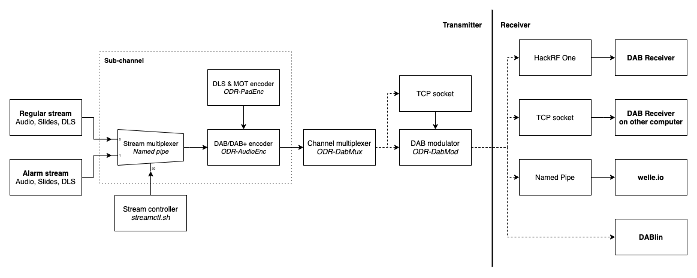

Deze repository bevat een aantal programma's en scripts om lokaal of via een
HackRF One een demo van DAB alarm berichten uit te voeren:

- ODR-AudioEnc: DAB/DAB+ audio encoder
- ODR-PadEnc: DLS (Journaline) en Slideshow encoder
- ODR-DabMux: DAB multiplexer
- ODR-DabMod: DAB signaal modulator (alleen voor HackRF One streaming)

# Compileren
Aanvankelijk zullen alle bovenstaande programma's apart moeten worden
gecompileerd. In die toekomst zal ik hier wellicht een simpel script voor
schrijven.

Vereisten:
- ImageMagick
- ffmpeg
- nmap-ncat
- Alle bovenstaande programma's gecompileerd (maar niet per se geïnstalleerd met
  `make install`)

# Configuratie
Configureer in dabmux.cfg de sub-kanalen. Maak en vul daarnaast de
mappenstructuur toegelicht in onderstaande secties.

## Streams
De `streams/` map bevat alle streams die kunnen worden uitgezonden. De
mappenstructuur is als volgt:

```
streams
└── [stream]
    ├── audio
    │   ├── 1.mp3
    │   ├── 2.opus
    │   ├── ...
    │   └── n.flac
    ├── slides
    │   ├── 1.jpg
    │   ├── 2.png
    │   ├── ...
    │   └── 3.txt
    └── dls.txt
```

Alle audio-formaten ondersteund door de geïnstalleerde versie van ffmpeg worden
ook door deze scripts ondersteund.

Alle slide-formaten ondersteund door de geïnstalleerde versie van ImageMagick
worden ook door deze scripts ondersteund.

## Live
`live/` bevat alle sub-kanalen. De mappenstructuur is als volgt:

```
live
└── [sub-kanaal]
    ├── audio
    ├── slides
    └── dls.txt
```

Bestanden worden automatisch met symbolic links aan de juiste mappen gelinkt.

# Uitvoeren
De ensemble zal eerst gestart moeten worden. Dit kan op verschillende manieren
afhankelijk van hoe de stream zal worden ontvangen.\
In onderstaande diagram is de stroming van data te zien en de verschillende
opties om het ensemble signaal te "broadcasten":



De output van ODR-DabMux is in de vorm van ETI frames. Dit is een
gestandaardiseerd formaat waar DAB multiplexer output in leveren. Dit staat
beschreven in [ETS 300 799](https://www.etsi.org/deliver/etsi_i_ets/300700_300799/300799/01_30_9733/ets_300799e01v.pdf).

ODR-DabMod kan in verschillende formaten of naar verschillende drivers output
leveren. In het voorbeeld hieronder, staat hoe dit met een HackRF One kan.\
Daarnaast kan de output naar en bestand, pipe of network stream worden
geschreven als I/Q samples.\
Dit alles en meer kan worden geconfigureerd in dabmod.ini, een voorbeeld voor de
HackRF One is bijgesloten. Zie ook het [voorbeeld bestand in de ODR-DabMod
repository](https://github.com/Opendigitalradio/ODR-DabMod/blob/master/doc/example.ini).

## Lokaal met DABlin
DABlin is een basale DAB/DAB+ decoder/ontvanger. Om de ETI frames lokaal, via
DABlin te ontvangen, gebruik het volgende commando:
```
$ odr-dabmux dabmux.cfg | dablin_gtk
```
Zorg ervoor dat [ODR-DabMux](https://github.com/Opendigitalradio/ODR-DabMux) en
[DABlin](https://github.com/Opendigitalradio/dablin) geïnstalleerd zijn.

## Via een named pipe met welle.io
Welle.io is een iets geavanceerdere

## Met een HackRF One
De HackRF One is een low-power transceiver. Dit apparaat kan worden gebruikt om
het signaal over de ether te zenden. Let op dat hier een vergunning voor vereist
is! Bijgesloten is een configuratiebestand van ODR-DabMod voor de HackRF One
(dabmod.ini). Vergeet niet het kanaal/frequentie aan te passen!

TODO

## Over het netwerk
I/Q samples of ETI frames kunnen over het netwerk worden gestreamt, om
vervolgens op een andere computer via bijvoorbeeld DABlin te worden ontvangen.

Dit zou bijvoorbeeld zo kunnen:

Op de zender:
```
$ odr-dabmux dabmux.cfg | odr-dabmod -f /dev/stdout -m 1 -F u8 | ncat -l -k
--no-shutdown 0.0.0.0:1234
```

Op de ontvanger:
```
TODO test dit, ben de commando's vergeten oops
```

Hiervoor zijn [ODR-DabMux](https://github.com/Opendigitalradio/ODR-DabMux),
[ODR-DabMod](https://github.com/Opendigitalradio/ODR-DabMod) en
[nmap-ncat](https://nmap.org) op de zender vereist. Op de zender zal ...TODO

TODO sending odr-dabmux ETI frames over network

# Stream multiplexing
`./streamctl.sh` kan worden gebruikt om een stream aan een sub-kanaal te
koppelen. Om bijvoorbeeld een stream genaamd "radio" te koppelen aan sub-kanaal
1:

```
$ ./streamctl.sh 1 start radio
```

Als er al een stream op het sub-kanaal loopt, wordt deze automatisch gestopt.

Om een sub-kanaal te stoppen, kan het volgende commando worden gebruikt:

```
$ ./streamctl.sh 1 stop
```

## Alarm stream
Het idee van deze demo is dat door een "alarm" stream aan te maken, hier per
kanaal naar kan worden overgeswitcht zonder gebruikt te maken van DAB-EWF. Dit
is voordelig voor goedkope draadloze ontvangers die geen DAB-EWF ondersteunen.
